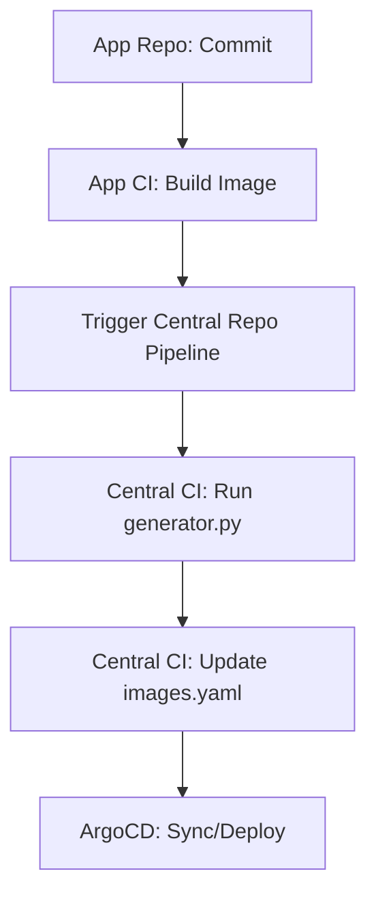

# Centralized Helm & CI Management Plan

This plan outlines how to effectively manage your Helm Monorepo and automation scripts in a centralized GitLab CI environment.

## 1. Repository Strategy

Keep the **Monorepo** as the "Central Source of Truth" for infrastructure.

### Structure Recommendation
```text
k8s-helm-monorepo/
├── apps_definition.yaml    # Single source of truth for all apps
├── helm-templates/        # Library charts (common-lib)
├── scripts/               # Automation scripts (generator.py)
├── charts/                # Generated charts (managed by CI)
├── argo/                  # ArgoCD ApplicationSets
└── .gitlab-ci.yml         # Core pipeline logic
```

## 2. CI/CD Pipeline Workflow

To manage this efficiently, use a **Trigger/Downstream** model.

### Flowchart: App Deployment


## 3. Key Management Practices

### A. Automated Chart Generation
The generator should run automatically whenever the definitions or the common library change.
- **Trigger**: Change in `apps_definition.yaml` or `helm-templates/`.
- **Action**: Run `scripts/generator.py`, then commit the changes back to the `charts/` directory.

### B. Image Tag Management (API-based)
As implemented in your current `.gitlab-ci.yml`, using the **GitLab Commits API** is the most robust way to update tags from external pipelines.
- **Benefit**: No need for complex SSH keys; tokens are scoped and audited.
- **Resource Grouping**: Always use `resource_group: helm-images-update` to prevent race conditions during concurrent updates.

### C. Versioning & Lifecycle
- **Library Chart**: Use Semantic Versioning (SemVer) for `common-lib`. Bump it and update `apps_definition.yaml` to test changes.
- **Generated Charts**: The generator should keep `Chart.yaml` versioning in sync with the app's release cycle.

## 4. Proposed Pipeline Enhancements

| Feature | Implementation Detail |
| :--- | :--- |
| **Validation** | Add a `lint` stage that runs `helm lint` on all generated charts before any commit. |
| **Dry-Run** | Add a manual `dry-run` job to see what files would change without committing. |
| **ArgoCD Sync** | Use `argocd app sync` via CI to trigger immediate deployment after updating the tag. |

## 5. Security & Access
1. **CI_JOB_TOKEN**: Use this where possible for registry access.
2. **Project Access Token**: Create a dedicated token with `api` and `write_repository` scopes for the Central Repo to allow it to commit its own changes.
3. **Protected Branches**: Ensure `main` is protected to only allow CI/CD or authorized MRs to update the charts.

---

### Next Steps
1. [ ] Update `scripts/generator.py` to be callable from a job with parameters (e.g. `--app api-gateway`).
2. [ ] Expand `.gitlab-ci.yml` to include a `generate-all` job for global updates.
3. [ ] Configure GitLab Webhooks or CI Triggers to connect Application Repos to this Central Monorepo.
